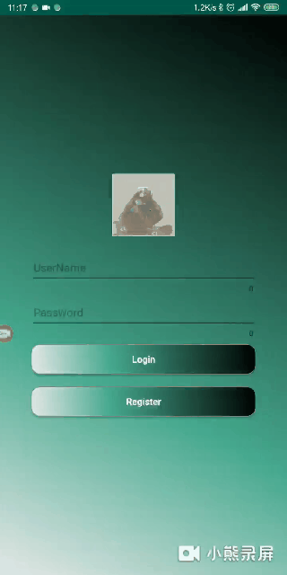
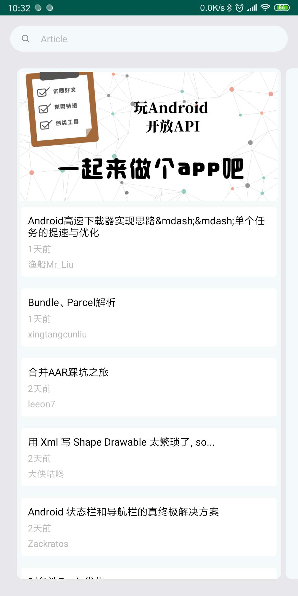
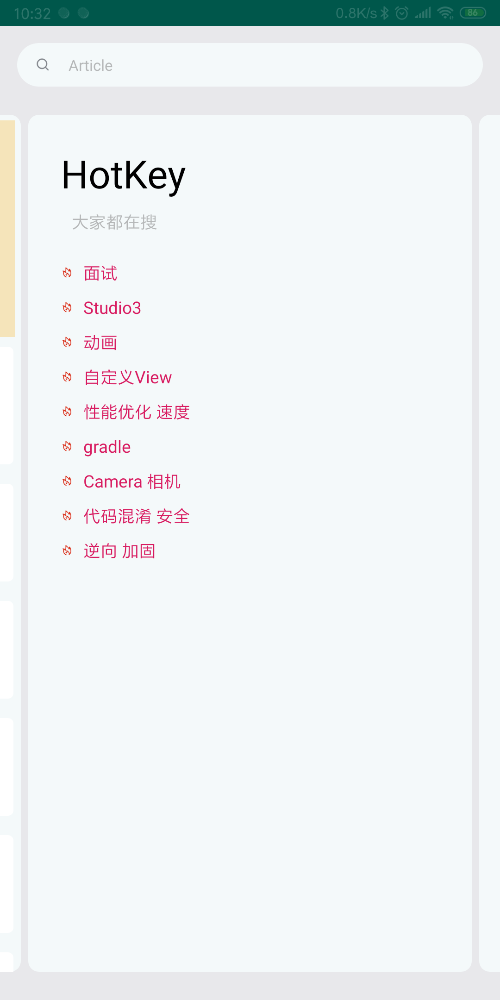
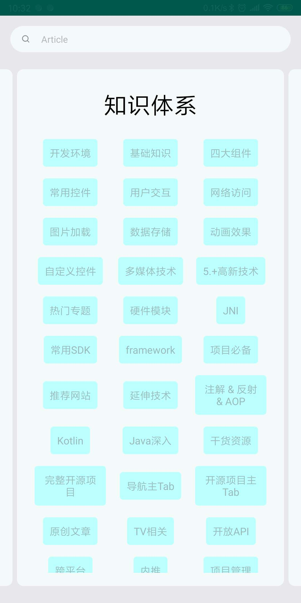
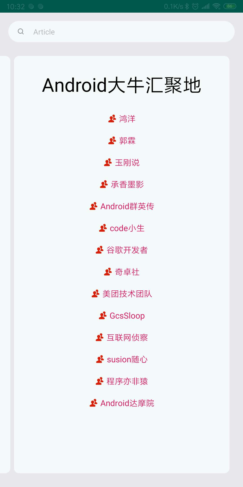
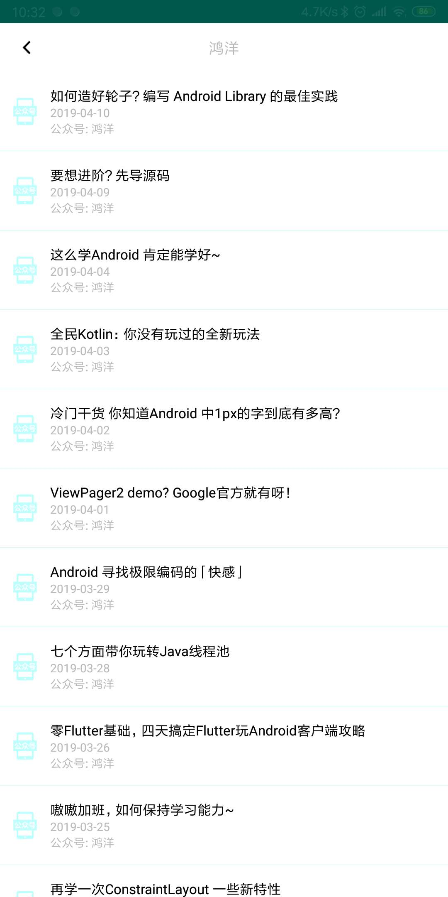
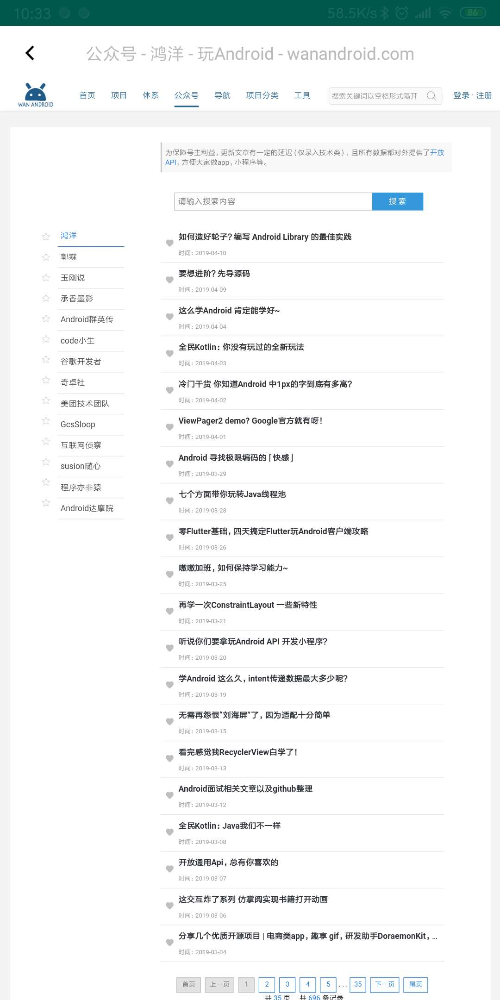
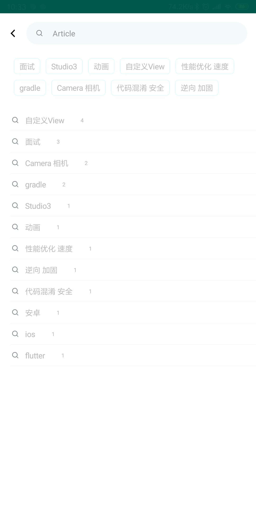

# WanKotlin
使用Kotlin语言开发的WanAndroid客户端，使用了 AndroidX 库和 RxJava、Retrofit、OkHttp 等开源技术。

初始界面如下(持续更新)：

  
  
  
  
  
  
  
  
  

## 目前已完成的功能：

* 首页Banner
* 首页推荐文章
* 搜索热词
* 搜索热词本地保存
* 项目分类
* 登录、注册和退出
* 公众号Tab
* 收藏文章（线上收藏和本地收藏）
* 取消收藏
* 搜索功能

**后续会持续更新未完成的功能，如大家有歧义的地方，可提Issues，谢谢！**

## 友情感谢：

[Kotlin](https://github.com/JetBrains/kotlin)

[AndroidX](https://developer.android.com/jetpack/androidx)

[okhttp](https://github.com/square/okhttp)

[retrofit](https://github.com/square/retrofit)

[RxJava](https://github.com/ReactiveX/RxJava)

[Glide](https://github.com/bumptech/glide)

[Banner](https://github.com/youth5201314/banner)

[FlowLayout](https://github.com/hongyangAndroid/FlowLayout)

[LitePal](https://github.com/LitePalFramework/LitePal)

[SmartRefreshLayout](https://github.com/scwang90/SmartRefreshLayout)

